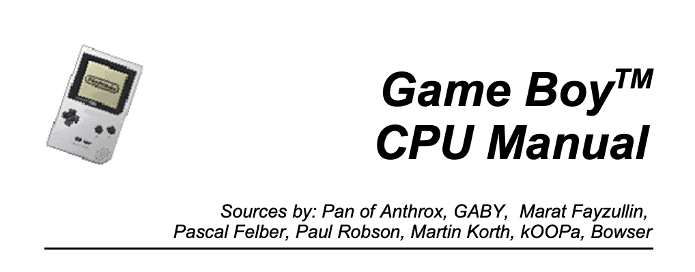
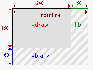
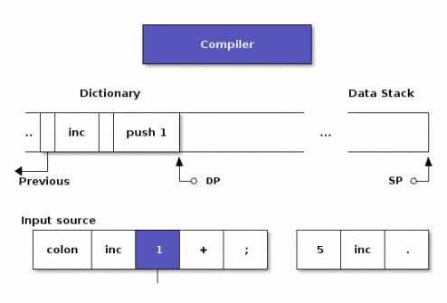
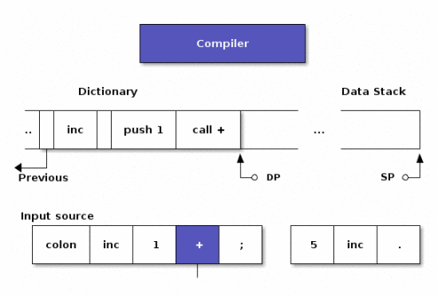
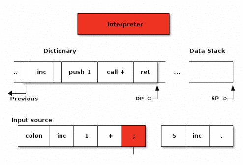
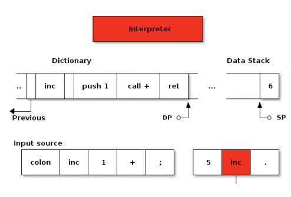

title: "GBForth"
controls: false
progress: true
numbers: true
theme: tkers/cleaver-theme-dmg

--

# GBForth

## Using Forth to understand the Game Boy


--

### Speaker intro

- David Vázquez Púa ([@davazp](https://github.com/davazp))
- Tijn Kersjes ([@tkers](https://github.com/tkers))


*Reaktor Amsterdam*

--

### After-hours hacking

- Write an emulator?
- ...a Game Boy game?
- ...a **compiler**!

<!--  -->


--

# Initial research



--

### Game Boy hardware

- 8-bit CPU
- 4 MHz (~1M instructions)
- 32kB ROM (of which 16 bankable)
- 4kB RAM

## 

--

# Approaches we considered

- Keep reading the manual
- Start writing a compiler (somehow)
- ...wait forever until you get something on the screen

--

# However...

- Not incremental
- Long feedback cycle

--

# Our approach ✨

- Start with working game (example)
- Reverse-engineer binary
- Try to refactor bytes
  - Add abstractions
  - Build libraries
- Write a compiler on top

--

### Forth

- Stack based
- Concatenative

```fs
: INC
  1 + ;
```

Only **numbers** and **words**:

```
1   →   PUSH 1
+   →   CALL +
```

--

### Interpreter state


_`:` starts a new definition_

--

### Create new definition


_read the name of the definition_

--

### Compiler State


_compile the body (1)_

--

### Compiler State


_compile the body (2)_

--

### End definition


_compile return_

--

### Push a value


_push 5 on the stack_

--

### Execute a defintition


_execute the body of `inc`_

--


--

### Binary ROM

```
$00  $c3  $50  $01  $ce  $ed  $66  $66
$cc  $0d  $00  $0b  $03  $73  $00  $83
$00  $0c  $00  $0d  $00  $08  $11  $1f
$88  $89  $00  $0e  $dc  $cc  $6e  $e6
$dd  $dd  $d9  $99  $bb  $bb  $67  $63
$6e  $0e  $ec  $cc  $dd  $dc  $99  $9f
$bb  $b9  $33  $3e  $45  $58  $41  $4d
$50  $4c  $45  $00  $00  $00  $00  $00
$00  $00  $00  $00  $00  $00  $00  $00
$00  $00  $01  $33
```

--

### Forth program that emits bytes

<pre>
$00 <span style="color: #0000dd">c,</span> $c3 <span style="color: #0000dd">c,</span> $50 <span style="color: #0000dd">c,</span> $01 <span style="color: #0000dd">c,</span> $ce <span style="color: #0000dd">c,</span> $ed <span style="color: #0000dd">c,</span> $66 <span style="color: #0000dd">c,</span> $66 <span style="color: #0000dd">c,</span>
$cc <span style="color: #0000dd">c,</span> $0d <span style="color: #0000dd">c,</span> $00 <span style="color: #0000dd">c,</span> $0b <span style="color: #0000dd">c,</span> $03 <span style="color: #0000dd">c,</span> $73 <span style="color: #0000dd">c,</span> $00 <span style="color: #0000dd">c,</span> $83 <span style="color: #0000dd">c,</span>
$00 <span style="color: #0000dd">c,</span> $0c <span style="color: #0000dd">c,</span> $00 <span style="color: #0000dd">c,</span> $0d <span style="color: #0000dd">c,</span> $00 <span style="color: #0000dd">c,</span> $08 <span style="color: #0000dd">c,</span> $11 <span style="color: #0000dd">c,</span> $1f <span style="color: #0000dd">c,</span>
$88 <span style="color: #0000dd">c,</span> $89 <span style="color: #0000dd">c,</span> $00 <span style="color: #0000dd">c,</span> $0e <span style="color: #0000dd">c,</span> $dc <span style="color: #0000dd">c,</span> $cc <span style="color: #0000dd">c,</span> $6e <span style="color: #0000dd">c,</span> $e6 <span style="color: #0000dd">c,</span>
$dd <span style="color: #0000dd">c,</span> $dd <span style="color: #0000dd">c,</span> $d9 <span style="color: #0000dd">c,</span> $99 <span style="color: #0000dd">c,</span> $bb <span style="color: #0000dd">c,</span> $bb <span style="color: #0000dd">c,</span> $67 <span style="color: #0000dd">c,</span> $63 <span style="color: #0000dd">c,</span>
$6e <span style="color: #0000dd">c,</span> $0e <span style="color: #0000dd">c,</span> $ec <span style="color: #0000dd">c,</span> $cc <span style="color: #0000dd">c,</span> $dd <span style="color: #0000dd">c,</span> $dc <span style="color: #0000dd">c,</span> $99 <span style="color: #0000dd">c,</span> $9f <span style="color: #0000dd">c,</span>
$bb <span style="color: #0000dd">c,</span> $b9 <span style="color: #0000dd">c,</span> $33 <span style="color: #0000dd">c,</span> $3e <span style="color: #0000dd">c,</span> $45 <span style="color: #0000dd">c,</span> $58 <span style="color: #0000dd">c,</span> $41 <span style="color: #0000dd">c,</span> $4d <span style="color: #0000dd">c,</span>
$50 <span style="color: #0000dd">c,</span> $4c <span style="color: #0000dd">c,</span> $45 <span style="color: #0000dd">c,</span> $00 <span style="color: #0000dd">c,</span> $00 <span style="color: #0000dd">c,</span> $00 <span style="color: #0000dd">c,</span> $00 <span style="color: #0000dd">c,</span> $00 <span style="color: #0000dd">c,</span>
$00 <span style="color: #0000dd">c,</span> $00 <span style="color: #0000dd">c,</span> $00 <span style="color: #0000dd">c,</span> $00 <span style="color: #0000dd">c,</span> $00 <span style="color: #0000dd">c,</span> $00 <span style="color: #0000dd">c,</span> $00 <span style="color: #0000dd">c,</span> $00 <span style="color: #0000dd">c,</span>
$00 <span style="color: #0000dd">c,</span> $00 <span style="color: #0000dd">c,</span> $01 <span style="color: #0000dd">c,</span> $33 <span style="color: #0000dd">c,</span>
</pre>

--

### Find the patterns and meaning

<pre>
$00 c, $c3 c, $50 c, $01 c, <span style="color: #0000dd">$ce c, $ed c, $66 c, $66 c,
$cc c, $0d c, $00 c, $0b c, $03 c, $73 c, $00 c, $83 c,
$00 c, $0c c, $00 c, $0d c, $00 c, $08 c, $11 c, $1f c,
$88 c, $89 c, $00 c, $0e c, $dc c, $cc c, $6e c, $e6 c,
$dd c, $dd c, $d9 c, $99 c, $bb c, $bb c, $67 c, $63 c,
$6e c, $0e c, $ec c, $cc c, $dd c, $dc c, $99 c, $9f c,
$bb c, $b9 c, $33 c, $3e c,</span> <span style="color: #dd0000">$45 c, $58 c, $41 c, $4d c,
$50 c, $4c c, $45 c, $00 c, $00 c, $00 c, $00 c, $00 c,
$00 c, $00 c, $00 c, $00 c, $00 c, $00 c, $00 c, $00 c,</span>
$00 c, $00 c, $01 c, $33 c,
</pre>

--

### Extract patterns into definitions

<pre>
<span style="color: #0000dd"><b>: logo</b>
  $ce c, $ed c, $66 c, $66 c, $cc c, $0d c, $00 c, $0b c,
  $03 c, $73 c, $00 c, $83 c, $00 c, $0c c, $00 c, $0d c,
  $00 c, $08 c, $11 c, $1f c, $88 c, $89 c, $00 c, $0e c,
  $dc c, $cc c, $6e c, $e6 c, $dd c, $dd c, $d9 c, $99 c,
  $bb c, $bb c, $67 c, $63 c, $6e c, $0e c, $ec c, $cc c,
  $dd c, $dc c, $99 c, $9f c, $bb c, $b9 c, $33 c, $3e c, <b>;</b></span>

<span style="color: #dd0000"><b>: title</b>
  $45 c, $58 c, $41 c, $4d c, $50 c, $4c c, $45 c, $00 c,
  $00 c, $00 c, $00 c, $00 c, $00 c, $00 c, $00 c, $00 c, <b>;</b></span>

$00 c, $c3 c, $50 c, $01 c,
<span style="color: #0000dd">logo</span>
<span style="color: #dd0000">title</span>
$00 c, $00 c, $01 c, $33 c,

</pre>

--

### Starting an Assembler

- How 0x33 can be extracted into INC-A

--

### Implement assembler


--

### Full Forth Assembler

<pre>
di,
$ffff # sp ld,

%11100100 # a ld,

a [rGBP] ld,

0 # a ld,
a [rSCX] ld,
a [rSCY] ld,

<span style="color: #99bb99">( ... )</span>
</pre>

--


--


--

# Now what?

--

### Simple Macros

<pre>
<span style="color: #0000dd"><b>: reset-scroll</b>
  0 # a ld,
  a [rSCX] ld,
  a [rSCY] ld, <b>;</b></span>

di,
$ffff # sp ld,

%11100100 # a ld,

a [rGBP] ld,

<span style="color: #0000dd">reset-scroll</span>

<span style="color: #99bb99">( ... )</span>
</pre>

--

- Introduce stack to communicate between Macros
- End up with Forth implementation
- Primitives

--

## Implementing Forth

- Break binary compatibility
- New testing strategy
  - Unit tests
  - Visual comparison
  - Using emulator for automated testing
- Rewriting _Hello World_ to Forth

--

### Implementing Forth

- Add a compiler
- Implement code primitives
- Adding libraries
- Replacing ASM with Forth

--


--

# The final test 💪

## Compiling a third party Forth game...

## &nbsp;

```fs
\ sokoban - a maze game in FORTH

\ Copyright (C) 1995,1997,1998,2003,2007,2012,2013,2015
\ Free Software Foundation, Inc.

\ This file is part of Gforth.

40 Constant /maze  \ maximal maze line

Create maze  1 cells allot /maze 25 * allot  \ current maze
Variable mazes   0 mazes !  \ root pointer
Variable soko    0 soko !   \ player position
Variable >maze   0 >maze !  \ current compiled maze

: maze-field ( -- addr n )
    maze dup cell+ swap @ chars ;

: .score ( -- )
    ." Level: " level# @ 2 .r ."  Score: " score @ 4 .r
    ."  Moves: " moves @ 6 .r ."  Rocks: " rocks @ 2 .r ;

: .maze ( -- )  \ display maze
    0 0 at-xy  .score
    cr  maze-field over + swap
    DO  I /maze type cr  /maze chars  +LOOP ;
```

--


--


--

### Future development 🚀

- ASM bug fixes
- Compiler optimisations
- GB Color support
- Declaritive RAM initialisation
- Automatic ROM bank switching
- Debugging tools
- **Actually writing a game**
- ...

-- dark

# 🤓 More?

- **[ams-hackers/gbforth](https://ams-hackers.github.io/gbforth)**
- [The Ultimate Game Boy Talk (33c3)](https://www.youtube.com/watch?v=HyzD8pNlpwI)
- [Reverse Engineering fine details of Game Boy hardware](https://www.youtube.com/watch?v=GBYwjch6oEE)


